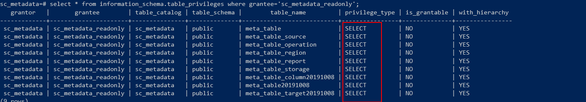

# pg数据库账用户权限查看


首先需要登录postgres的超管，进入命令行操作

```bash
\c sc_metadata;  # 切换到需要查看的数据库
 select * from pg_user;    #查看用户列表
 select * from information_schema.table_privileges where grantee='sc_metadata_readonly'; #查看这个用户对这个数据库的表的权限
 grant  SELECT  on TABLE meta_table_region to sc_metadata_readonly;  ## 给该用户授权 select
```



